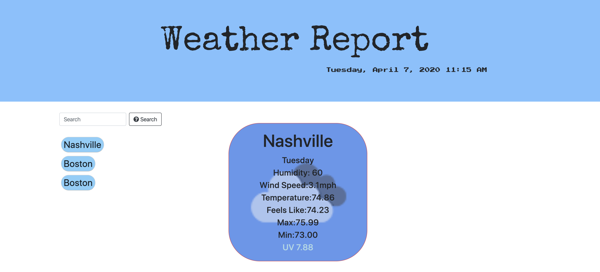
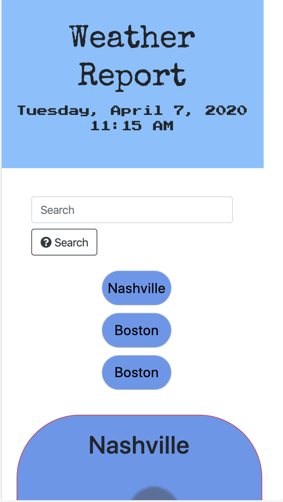

<h1 align= "center">Weather Report</h1> 
<h2>Live Link</h2>
<h3><a href= "https://chaalexander.github.io/weatherreport/">Live Link</a></h3> 
<h2> Table of Contents </h2>
<li><a href="#description">Description</a></li>  
<li><a href="#tech">Technology Stack</a></li> 
<li><a href="#usage">Usage</a></li> 
<li><a href="#screen">ScreenShots</a></li> 
<li><a href="#contributors">Contributors</a></li>   
<li><a href="#contact">Contact</a></li> 
<h2 id="description"> Description </h2>

Weather report application.
   
<h2 id="tech"> Technology Stack </h2>          

 JavaScript, Html, Boostrap, Css
          
<h2 id="usage"> Usage </h2>

Typed the name of a city you want to see the current weather and the next 5 days. The last search will create a button with the information of the city. Whenever the user wants to see that city again, just click the button.
   
<h2 id="screen"> ScreenShoots </h2>
<h4>Desktop view</h4>

<h4>Mobile view</h4>

<h2 id="contributors"> Contributors </h2>

<a href= "https://github.com/chaalexander">@chaalexander</a>
 
<h2 id="contact"> Contact </h2>         
<h5> Name: Charlenne Alexander </h5>       
<h5><a href= "https://github.com/chaalexander">GitHub</a></h5>  
<h5><a href= "https://chaalexander.github.io/">Portfolio</a></h5>  
<h5><a href= "mailto:charlennep@gmail.com">charlennep@gmail.com</a></h5>       
<h5><a href= "https://www.linkedin.com/in/cha-alexander">LinkedIn</a></h5>    
